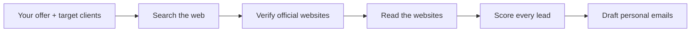

# MarketScout

**An autonomous AI agent that finds your next clients.**

[Live demo](https://market-scout-teal.vercel.app)

<!-- Screenshot: nahraj ho do složky docs/ a odkomentuj další řádek

-->

Describe what you offer and who you are looking for. MarketScout searches the web, verifies official websites, reads them, scores every lead and drafts a personal outreach email, live in front of you.

## What it does

1. **Takes your brief.** You describe your service and the type of client you want (for example: "I build modern websites and AI chatbots for small businesses" and "Independent coffee shops in Ottawa, Canada").
2. **Searches the live web** for matching businesses.
3. **Verifies official websites**, so leads are real businesses and not random listings.
4. **Reads each website** to understand what the business does.
5. **Scores every lead** by how well it fits your offer.
6. **Drafts a personal email** for each lead.

Everything happens live, so you can watch the agent work. A run usually takes 30 to 60 seconds.



## Try it

Open the [live demo](https://market-scout-teal.vercel.app) and use one of the ready examples (coffee shops in Ottawa, pizzerias in Calgary, dentists in Toronto) or write your own.

> The free demo is limited to 3 runs per hour.

## Tech stack

- **Next.js** and **TypeScript**
- AI agent with live web search
- Hosted on **Vercel**

## Run locally

```bash
git clone https://github.com/bodie-codes/MarketScout-Autonomous-LeadGen-Agent.git
cd MarketScout-Autonomous-LeadGen-Agent
npm install
npm run dev
```

Then open <http://localhost:3000>.

<!-- Sem doplň názvy proměnných z .env (klíč k AI a k vyhledávání), nikdy ne jejich hodnoty -->

## Author

Built by **Bodie** · [bodiecodes.com](https://www.bodiecodes.com) · [LinkedIn](https://www.linkedin.com/in/bodiecodes)
